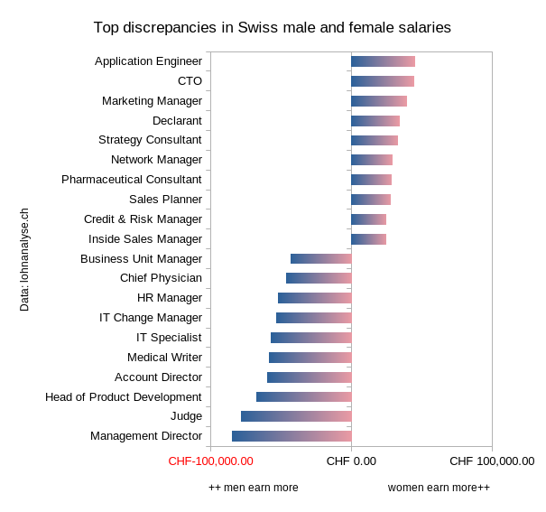

This is a [Data Package](https://frictionlessdata.io/data-packages/) made with the [Open Data Application](https://github.com/okfn/opendataeditor), started as part of the [Open Data Advent Calendar](https://reciprocal.opendata.ch/project/37) 2023. 

We are collecting sample datasets and links on gender inequality and gender (mis)representation here. You are welcome to suggest others in the [Issues](issues/), or upload your own files into the [data/] folder, update this README with another section, and start a Pull Request.

## Lohnanalyse.ch

This is a crowdsourced dataset representing the difference in salaries between common jobs in Switzerland. Neithe we nor its authors make any claims of accuracy or representativeness. There is currently no indication on the data source website that the data is protected by copyright, or may be redistributed under a certain license - and we will update this notice when we get their response.

Copy and paste the data from [Lohnanalyse.ch](https://www.lohnanalyse.ch/), apply some regular expressions to clean it up, and paste it into a spreadsheet. There does not seem to be a way at the moment to export the data, and no automated process to scrape the data exists at the moment.

Please get permission from [Lohnanalyse.ch](https://lohnanalyse.ch) for using this data for any purposes non-commercial, commercial, or otherwise. 

Here is an example visualization of the top 10 male and top 10 female discrepancies:

Download the chart in [English or German here](images/).

# License

This Data Package - which includes the metadata, but *not* necessarily any data redistributed along with it - is made available by its maintainers @loleg and @viktoria-molnar under the [ODC Open Database License](https://opendatacommons.org/licenses/odbl/) (ODbL), a copy of the full text of which is in [LICENSE.md](LICENSE.md).

_In the spirit of community and love to your fellow humankind._

♀️♂️⚧️