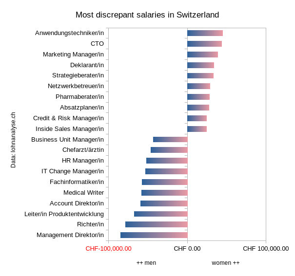

This is a [Data Package](https://frictionlessdata.io/data-packages/) made with [Open Data Application](https://github.com/okfn/opendataeditor) for the Open Data Advent 2023. In the spirit of community and love to your fellow humankind.

# Data

This is a crowdsourced dataset representing the difference in salaries between common jobs in Switzerland. We make no claims of accuracy, and have indeed not obtained permission to republish this data from the original maintainers. However, there is no indication on their website at this time that this data is protected by copyright or may not be redistributed.

# Usage

A simple visualization of the top 10 male and top 10 female discrepancies:

See https://reciprocal.opendata.ch/project/37

# Preparation

Copy and paste the data from [Lohnanalyse.ch](https://www.lohnanalyse.ch/), apply some regular expressions to clean it up and paste it into a spreadsheet. Sorry, no automated process exists at the moment.

# License

This Data Package is made available by its maintainers @loleg and @viktoria-molnar under the [Public Domain Dedication and License v1.0](http://www.opendatacommons.org/licenses/pddl/1.0/), a copy of the full text of which is in [LICENSE.md](LICENSE.md).

Please get permission from Lohnanalyse.ch for using this data for any purpose (non-commercial, commercial, or otherwise).
